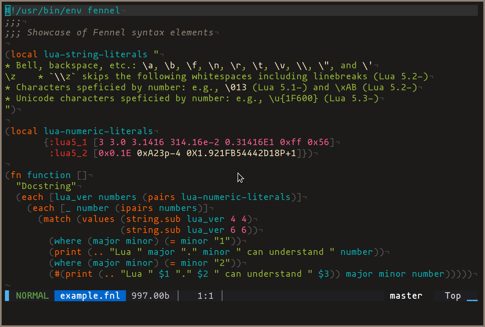
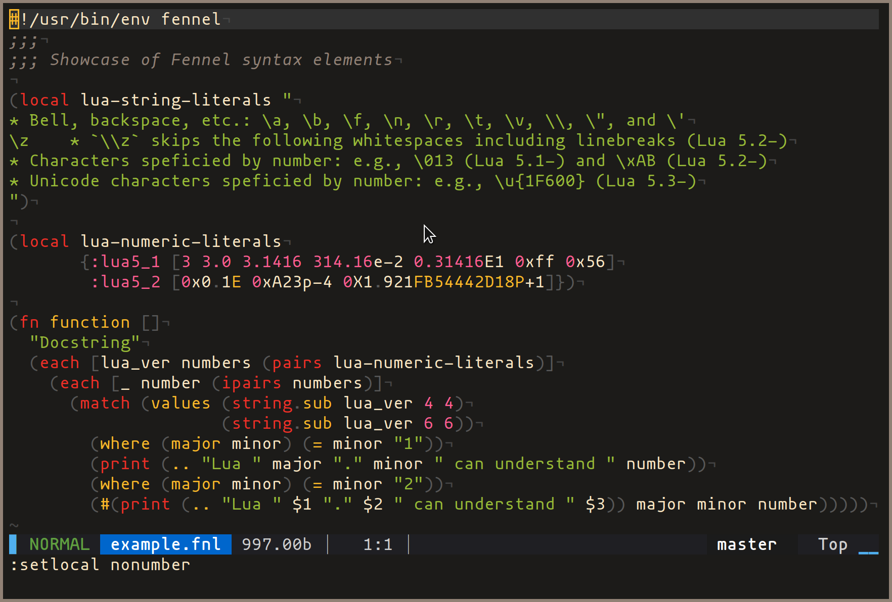
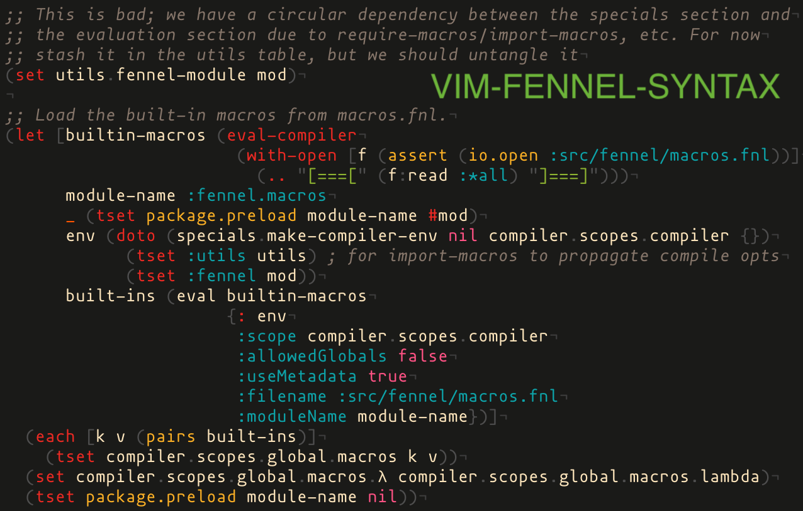

# vim-fennel-syntax

Vim syntax highlighting for [Fennel][1].
This is a personal fork from the original [fennel.vim][2].

## Comparison among Fennel highlight plugins:

### aniseed


### tree-sitter


### vim-fennel-syntax


## Installation

Use your favorite package manager. For example using [Paq][3]:

```lua
require'paq-nvim' {
  'mnacamura/vim-fennel-syntax',
}
```

## Options

For all options, if both global and buffer local ones are defined, the
buffer local one takes precedence.

### `fennel_lua_version`

Highlight literals and keywords for the given Lua version.
Supports `5.1`, `5.2`, `5.3`, and `5.4`.
If not set, it will be inferred and set automatically by invoking `lua -v`
command.

```vim
let g:fennel_lua_version = '5.4'  " default: inferred from environment
```

If `g:fennel_lua_version` and `b:fennel_lua_version` are not set and `lua` is
not found in path, it defaults to `5.1`.

### `fennel_use_luajit`

Highlight literals and keywords extended in [LuaJIT][5].
If not set, it will be inferred and set automatically by invoking `lua -v`
command.

```vim
let g:fennel_use_luajit = 0  " default: inferred from environment
```

If `g:fennel_use_luajit` and `b:fennel_use_luajit` are not set and
`lua` (LuaJIT) is not found in path, it defaults to `0`.

### `fennel_use_lume`

Highlight keywords provided by [Lume][4].

```vim
let g:fennel_use_lume = 1  " default: 1
```

## Change log

### Unreleased

* Add option `{g,b}:fennel_lua_version`
* Add option `{g,b}:fennel_use_luajit`

### [0.1][v0.1] (2021-06-13)

* Support Fennel 0.9.2
* Support Lua string literals up to version 5.4
* Support Lua numeric literals up to version 5.4

## License

[MIT](LICENSE)

[1]: https://fennel-lang.org/
[2]: https://github.com/bakpakin/fennel.vim/
[3]: https://github.com/savq/paq-nvim/
[4]: https://github.com/rxi/lume/
[5]: https://luajit.org/extensions.html
[v0.1]: https://github.com/mnacamura/vim-fennel-syntax/tree/v0.1

<!-- vim: set tw=78 spell: -->
