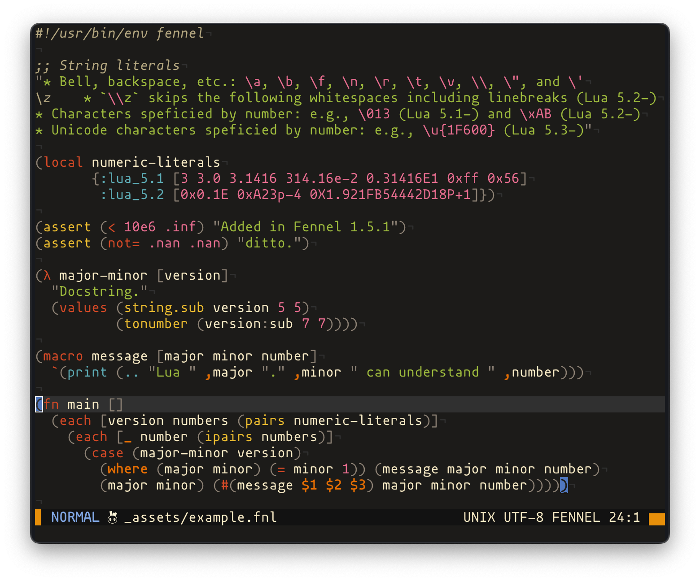

<!-- panvimdoc-ignore-start -->

# vim-fennel-syntax

This is a Vim syntax highlighting plugin for [Fennel][1],
forked and enhanced from the original [fennel.vim][2].

[![check_badge]][check_status]
[![Fennel][fennel_badge]][1]

[check_badge]: https://img.shields.io/github/actions/workflow/status/m15a/vim-fennel-syntax/check.yml?logo=github&label=Check&style=flat-square
[check_status]: https://github.com/m15a/vim-fennel-syntax/actions/workflows/check.yml
[fennel_badge]: https://img.shields.io/badge/Fennel-v1.6.0-fff3d7.svg?style=flat-square



## Features

- **Pure Vim script**:
  Built entirely with Vim script, making it accessible to both Vim
  and Neovim users.
- **Comprehensive highlighting**:
  Provides attentive highlighting for advanced syntax, including:
    - Hash function literals (e.g., `#(+ $1 $2)`)
    - Shebang lines (e.g., `#!/usr/bin/env fennel`)
    - And more.
- **Granular Lua version support**:
  Highlights literals and keywords differently based on your Lua
  version. This helps you easily spot potential syntax errors related
  to Lua version differences [^1].

[^1]: For example, hex numeric literals with exponents (e.g.,
`0xA23p-4`) are only supported in Lua 5.2 and later.

## Installation

### Using Vim/Neovim plugin manager

Use your preferred Vim/Neovim package manager. Here is an example using
[Paq][3] for Neovim:

```lua
require'paq' {
  ..., -- other plugins
  'm15a/vim-fennel-syntax',
  ..., -- other plugins
}
```

### Using Nix flake

This repository provides a Nix flake for the plugin.
By using the provided overlay, you can add this plugin to your
Vim/Neovim configuration. The plugin package is available at
the `pkgs.m15aVimPlugins.vim-fennel-syntax` attribute path.

The following example shows how to configure Neovim with
this plugin enabled in `flake.nix`:

```nix
{
  inputs = {
    nixpkgs.url = "github:NixOS/nixpkgs/nixpkgs-unstable";
    flake-utils.url = "github:numtide/flake-utils";
    vim-fennel-syntax.url = "github:m15a/vim-fennel-syntax";
  };

  outputs =
    {
      nixpkgs,
      flake-utils,
      vim-fennel-syntax,
      ...
    }:
    flake-utils.lib.eachDefaultSystem (
      system:
      let
        pkgs = import nixpkgs {
          inherit system;
          overlays = [ vim-fennel-syntax.overlays.default ];
        };
      in
      {
        packages.default = pkgs.neovim.override {
          configure = {
            packages.example = {
              start = [
                pkgs.m15aVimPlugins.vim-fennel-syntax
              ];
            };
          };
        };
      }
    );
}
```

<!-- panvimdoc-ignore-end -->

<!-- panvimdoc-include-comment

```vimdoc
Maintainer: NACAMURA Mitsuhiro <m15@m15a.dev>
URL: https://github.com/m15a/vim-fennel-syntax
License: MIT
```

-->

## Configuration

This plugin will automatically configure most options based on your
environment. To customize options manually, you can set the following
global (`g:*`) or buffer-local (`b:*`) variables.

### Options

| Option                                    | Description                                              | Type    | Default value |
|-------------------------------------------|----------------------------------------------------------|---------|---------------|
| [fennel_lua_version](#fennel_lua_version) | The Lua version used for highlighting literals/keywords. | string  | auto-detected |
| [fennel_use_luajit](#fennel_use_luajit)   | Enable highlighting for LuaJIT extentions.               | boolean | auto-detected |
| [fennel_use_lume](#fennel_use_lume)       | Enable highlighting for Lume keywords.                   | boolean | `1` (true)    |

#### `fennel_lua_version`

Specifies the Lua version (`5.1`, `5.2`, `5.3`, or `5.4`) for
highlighting corresponding literals and keywords. If not set manually,
it is inferred automatically by invoking `lua -v`.

```vim
let g:fennel_lua_version = '5.4'
```

> [!NOTE]
> If neither `g:fennel_lua_version` nor `b:fennel_lua_version` is set,
> and the Lua executable is not found in your `PATH`, the default
> version used is `5.1`.

#### `fennel_use_luajit`

Enables highlighting for literals and keywords extended by [LuaJIT][4].
If not configured manually, it is inferred automatically by invoking
`lua -v`.

```vim
let g:fennel_use_luajit = 0
```

> [!NOTE]
> If neither `g:fennel_use_luajit` nor `b:fennel_use_luajit` is set,
> and the LuaJIT executable is not found in your `PATH`, it defaults
> to `0` (false).

#### `fennel_use_lume`

Enable highlighting for keywords provided by the [Lume][5] library.
The default value is `1` (true).

```vim
let g:fennel_use_lume = 1
```

<!-- panvimdoc-ignore-start -->

## License

[The MIT license](LICENSE).

<!-- panvimdoc-ignore-end -->

[1]: https://fennel-lang.org/
[2]: https://github.com/bakpakin/fennel.vim/
[3]: https://github.com/savq/paq-nvim/
[4]: https://luajit.org/extensions.html
[5]: https://github.com/rxi/lume/

<!-- vim: set tw=72 spell nowrap: -->
